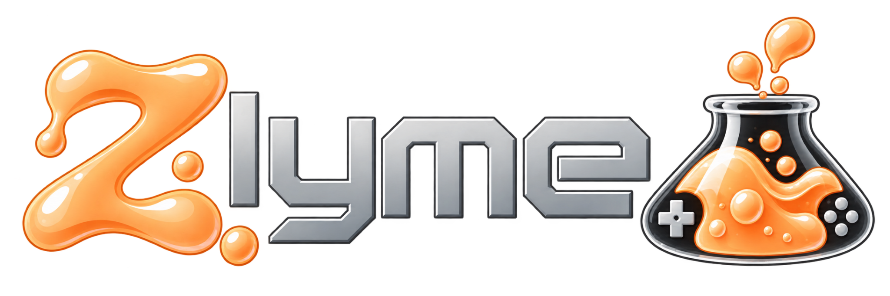

**Low latency. High viscosity.**

Zlyme is a custom OS for the **Miyoo Flip** based on buildroot, running mainline kernel and latest software available. It's engineered to ooze, cultured for speed. Hardware facts come from this device, emulator recipes are harvested where they already exist. The set is curated so it fits the Flip, instead of shipping a hundred cores nobody on this board will use. 

The frontend is based on [NextUI](https://github.com/LoveRetro/NextUI) (itself from [MinUI](https://github.com/shauninman/MinUI) by [Shaun Inman](https://github.com/shauninman)). There is no desktop and no compositor. **It boots in under 10 seconds.** 

**Everything on the device works:** Wi-Fi, Bluetooth (including audio and controller), HDMI, sleep, the lid, analog sticks, rumble, the headphone jack, USB OTG, and both SD slots are supported. It feature a dynamic scaling ram driver to save battery when playing light games, does not drain while off.

Pull requests and other contributions are welcome, if needed other systems will be supported.

Kernel, boot, and flashing detail lives in the [Miyoo Flip wiki](https://github.com/Zetarancio/Miyoo-Flip-Mainline-Linux-Reverse-Engineering).

## Features

Userspace is compiled at the fastest setting this CPU will take (`-O3`). A few libretro cores that miscompile are pinned back to `-O2` so they stay correct. The kernel stays on its usual performance profile. It offers both mali and panfrost (only mali supports Vulkan as of now). Optimized core pinning and per-emulator performance settings battle-tested by the friends at [SpruceOS](https://spruceui.github.io/).  


“It’s not buttery smooth. It’s slime-smooth.”  

### Systems


| System                    | Emulator                             |
| ------------------------- | ------------------------------------ |
| NES                       | Nestopia (libretro)                  |
| Game Boy / Game Boy Color | Gambatte (libretro)                  |
| Game Boy Advance          | gpSP (libretro)                      |
| SNES                      | Mednafen SuperFaust (libretro)       |
| Master System / Game Gear | Genesis Plus GX (libretro)           |
| Mega Drive / Genesis      | PicoDrive (libretro)                 |
| 32X                       | PicoDrive (libretro)                 |
| PC Engine                 | Mednafen PCE Fast (libretro)         |
| Neo Geo (AES/MVS)         | FinalBurn Neo (libretro)             |
| Arcade                    | MAME 2003-Plus (libretro)            |
| Neo Geo CD                | NeoCD (libretro)                     |
| Neo Geo Pocket            | Mednafen NGP (libretro)              |
| WonderSwan                | Mednafen WonderSwan (libretro)       |
| Virtual Boy               | Mednafen VB (libretro)               |
| Pokémon Mini              | PokeMini (libretro)                  |
| Atari 2600                | Stella (libretro)                    |
| Atari 7800                | ProSystem (libretro)                 |
| Atari Lynx                | Handy (libretro)                     |
| 3DO                       | Opera (libretro)                     |
| DOS                       | DOSBox Pure (libretro)               |
| PlayStation               | PCSX ReARMed (libretro)              |
| Nintendo 64               | Mupen64Plus-Next (libretro)          |
| Saturn                    | YabaSanshiro (libretro)              |
| TIC-80                    | TIC-80 (libretro)                    |
| Pico-8                    | Official Pico-8 (you add `pico8_64`) |
| PSP                       | PPSSPP                               |
| Dreamcast                 | Flycast                              |
| Nintendo DS               | DraStic                              |
| Amiga                     | Amiberry                             |
| Doom                      | GZDoom                               |
| Portmaster                | Built-in                             |


Libretro cores run through RetroArch. The rest are standalones. This list we'll change over time.

### Tools

Each community pak below was ported (paths, Flip joystick, this image’s binaries).

- **Settings** — Wi-Fi, Bluetooth, SSH, Samba, Syncthing, GPU, HDMI, OTG, second SD, governors, undervolt, backup. Based on NextUI.
- **Artwork Scraper** — matches ROM names to box art and downloads it. From [minui-artwork-scraper-pak](https://github.com/josegonzalez/minui-artwork-scraper-pak).
- **ScrapeGoat** — ScreenScraper metadata and images. From [nextui-scrapegoat-pak](https://github.com/Helaas/nextui-scrapegoat-pak). Requires a [Screenscraper.fr](http://Screenscraper.fr) account. 
- **Overlays** — browse and install community bezels. From [nextui-community-overlays](https://github.com/LoveRetro/nextui-community-overlays).
- **Moonlight** — stream a PC game to the Flip. From [nextui-moonlight-pak](https://github.com/richieszemeredi/nextui-moonlight-pak).
- **PortMaster** — install game ports. From [PortMaster-GUI](https://github.com/PortsMaster/PortMaster-GUI).
- **Files** — browse the card.  ([vtree](package/system/vtree)).
- **Autocal** — save analog-stick calibration.
- **Update** — **OTA**: pulls a release tar, checks the hash, and reboots into the new OS.


## Install

GitHub Actions and Releases are not live yet. When they are, a downloadable image and an update tar will appear on this repository’s Releases page.

The Flip will not boot an SD OS until you change how it starts. Without one of the steps below, it keeps booting stock from internal storage and ignores the card.

1. **apommel-multiboot** (recommended). Repairs the vendor preloader. No card → stock. Bootable card → that OS. Follow the [wiki how-to](https://github.com/Zetarancio/Miyoo-Flip-Mainline-Linux-Reverse-Engineering/blob/main/docs/boot-and-flash/sd-multiboot-apommel.md). The on-device app is [apommel-multiboot](https://github.com/Zetarancio/Miyoo-Flip-Mainline-Linux-Reverse-Engineering/tree/main/preloader-stock-rocknix/App/apommel-multiboot) in that repo. See the wiki for the supported OS list.
2. **Erase the preloader.** Then the Flip always boots from SD (or enter MASKROM mode if none is inserted). Wiki: [stock ↔ SD-boot without opening the device](https://github.com/Zetarancio/Miyoo-Flip-Mainline-Linux-Reverse-Engineering/blob/main/docs/boot-and-flash/stock-rocknix-without-disassembly.md).

Flash `zlyme.img` onto a dedicated OS card (Balena Etcher or any image writer). Do not flash over a card that already has games. Put that card in the **right** slot (next to power). Later updates are the OTA tar from Tools → Update.

## Roms and Bios

Games and BIOS live on the **ZLYME** partition (`/storage` on the device). NextUI only lists a system if that folder exists and is not empty. The name must include the tag in parentheses — that tag is how the pak is chosen.


| Folder                                            | System                   |
| ------------------------------------------------- | ------------------------ |
| `Roms/Nintendo Entertainment System (FC)/`        | NES                      |
| `Roms/Game Boy (GB)/`                             | Game Boy                 |
| `Roms/Game Boy Color (GBC)/`                      | Game Boy Color           |
| `Roms/Game Boy Advance (GBA)/`                    | Game Boy Advance         |
| `Roms/Super Nintendo Entertainment System (SFC)/` | SNES                     |
| `Roms/Sega Master System (MS)/`                   | Master System            |
| `Roms/Sega Game Gear (GG)/`                       | Game Gear                |
| `Roms/Sega Genesis (MD)/`                         | Mega Drive / Genesis     |
| `Roms/Sega 32X (32X)/`                            | 32X                      |
| `Roms/PC Engine (PCE)/`                           | PC Engine                |
| `Roms/FBNeo (FBNEO)/`                             | Neo Geo / arcade (FBNeo) |
| `Roms/MAME (MAME)/`                               | Arcade (MAME 2003-Plus)  |
| `Roms/Neo Geo CD (NEOCD)/`                        | Neo Geo CD               |
| `Roms/Neo Geo Pocket (NGP)/`                      | Neo Geo Pocket           |
| `Roms/WonderSwan (WS)/`                           | WonderSwan               |
| `Roms/Virtual Boy (VB)/`                          | Virtual Boy              |
| `Roms/Pokemon Mini (PKM)/`                        | Pokémon Mini             |
| `Roms/Atari 2600 (A26)/`                          | Atari 2600               |
| `Roms/Atari 7800 (A78)/`                          | Atari 7800               |
| `Roms/Atari Lynx (LYNX)/`                         | Atari Lynx               |
| `Roms/3DO (3DO)/`                                 | 3DO                      |
| `Roms/DOS (DOS)/`                                 | DOS                      |
| `Roms/Sony PlayStation (PS)/`                     | PlayStation              |
| `Roms/Nintendo 64 (N64)/`                         | Nintendo 64              |
| `Roms/Sega Saturn (SATURN)/`                      | Saturn                   |
| `Roms/TIC-80 (TIC)/`                              | TIC-80                   |
| `Roms/Pico-8 (PICO)/`                             | Pico-8                   |
| `Roms/Sony PlayStation Portable (PSP)/`           | PSP                      |
| `Roms/Sega Dreamcast (DC)/`                       | Dreamcast                |
| `Roms/Nintendo DS (NDS)/`                         | Nintendo DS              |
| `Roms/Commodore Amiga (AMIGA)/`                   | Amiga                    |
| `Roms/Doom (DOOM)/`                               | Doom                     |


BIOS files go in `Bios/` (RetroArch `system` dir). A second card in the other slot is picked up if it has a `Roms/` (or `roms/`) folder; `Bios/` or `Roms/bios` on that card is used the same way. Saves are `Saves/`.

## Build

Docker is required.

```sh
cp storage.sh.example storage.sh   # optional; set local paths
./build.sh --config zlyme_defconfig
```

The image lands in `output/images/`. 

## Thanks

[Sundownersport](https://github.com/Sundownersport) and the community behind [SpruceOS](https://spruceui.github.io/) for their continuing work and support.  
The frontend is based on [NextUI](https://github.com/LoveRetro/NextUI), a fork of [MinUI](https://github.com/shauninman/MinUI) by [Shaun Inman](https://github.com/shauninman). SD multiboot (repaired preloader) is derived from [apommel](https://github.com/apommel)’s work in [baseos-my355](https://github.com/apommel/baseos-my355). 

## License

See [LICENSE](LICENSE). Original Zlyme glue is MIT. This tree is **not** one license. NextUI is PolyForm Noncommercial 1.0.0. Each package and pak ships its own terms.