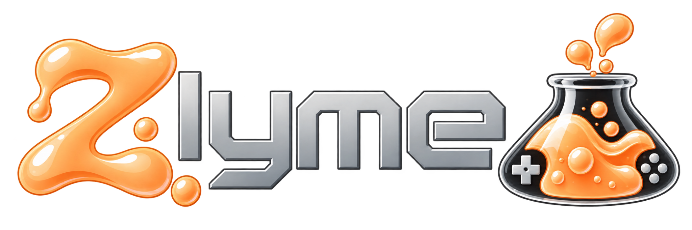

<p align="center">
  
</p>

**Low latency. High viscosity.**

Zlyme is a custom OS for the **Miyoo Flip** based on buildroot, running mainline kernel and latest software available. It's engineered to ooze, cultured for speed. Hardware facts come from this device, emulator recipes are harvested where they already exist. The set is curated so it fits the Flip, instead of shipping a hundred cores nobody on this board will use. 

The frontend is based on [NextUI](https://github.com/LoveRetro/NextUI) (itself from [MinUI](https://github.com/shauninman/MinUI) by [Shaun Inman](https://github.com/shauninman)). There is no desktop and no compositor. **It boots in under 10 seconds.** 

**Everything on the device works:** Wi-Fi, Bluetooth (including audio and controller), HDMI, sleep, the lid, analog sticks, rumble, the headphone jack, USB OTG, and both SD slots are supported. It feature a dynamic scaling ram driver to save battery when playing light games, does not drain while off.

Pull requests and other contributions are welcome, if needed other systems will be supported.

Kernel, boot, and flashing detail lives in the [Miyoo Flip wiki](https://github.com/Zetarancio/Miyoo-Flip-Mainline-Linux-Reverse-Engineering).

## Features

Userspace is compiled at the fastest setting this CPU will take (`-O3`). A few libretro cores that miscompile are pinned back to `-O2` so they stay correct. The kernel stays on its usual performance profile. It offers both mali and panfrost (only mali supports Vulkan as of now). Optimized core pinning and per-emulator performance settings battle-tested by the friends at [SpruceOS](https://spruceui.github.io/).  


“It’s not buttery smooth. It’s slime-smooth.”  

### Tools

Each community pak below was ported (paths, Flip joystick, this image’s binaries).

- **Settings** — Wi-Fi, Bluetooth, SSH, Samba, Syncthing, GPU, HDMI, OTG, second SD, governors, undervolt, backup. Based on NextUI.
- **Artwork Scraper** — matches ROM names to box art and downloads it. From [minui-artwork-scraper-pak](https://github.com/josegonzalez/minui-artwork-scraper-pak).
- **ScrapeGoat** — ScreenScraper metadata and images. From [nextui-scrapegoat-pak](https://github.com/Helaas/nextui-scrapegoat-pak). Requires a [Screenscraper.fr](http://Screenscraper.fr) account. 
- **Overlays** — browse and install community bezels. From [nextui-community-overlays](https://github.com/LoveRetro/nextui-community-overlays).
- **Moonlight** — stream a PC game to the Flip. From [nextui-moonlight-pak](https://github.com/richieszemeredi/nextui-moonlight-pak).
- **PortMaster** — install game ports. From [PortMaster-GUI](https://github.com/PortsMaster/PortMaster-GUI).
- **Files** — browse the card.  ([vtree](package/system/vtree)).
- **Autocal** — save analog-stick calibration.
- **Update** — **OTA**: pulls a release tar, checks the hash, and reboots into the new OS.

## Controls

The Miyoo Flip wiki Start+Vol brightness combo is not this device.

**Launcher**

- A open, B back
- MENU tap = quick menu
- Vol = volume; **MENU+Vol** = brightness
- Power = sleep
- Short Select does nothing (no game switcher)

**In a pak / game**

- **MENU+Start** closes whatever is running (libretro, standalones, PortMaster, Pico-8, Tools)
- MENU tap = RetroArch RGUI; standalones keep their own menu
- No color-temp shortcut (the Flip has no panel color-temperature sysfs; hue is not white-point)

Speaker vs jack is automatic (`flip-jackd`). Bluetooth audio follows the headset connect. `zlyme-audio` stays on the CLI for debug.

## Install

GitHub Actions builds the image on push to `main`. A cold image is several sequential jobs because hosted runners cap each job at six hours; later runs reuse ccache. A successful run publishes a GitHub Release (`zlyme-<run_id>`, also marked latest) with `zlyme.img` and the OTA tar. Update.pak pulls `/releases/latest`. The repo is private, so put a PAT with `repo` scope in `/storage/.config/github-token` on the device (one line, no quotes). Do not bake a token into the image.

The Flip will not boot an SD OS until you change how it starts. Without one of the steps below, it keeps booting stock from internal storage and ignores the card.

1. **apommel-multiboot** (recommended). Repairs the vendor preloader. No card → stock. Bootable card → that OS. Follow the [wiki how-to](https://github.com/Zetarancio/Miyoo-Flip-Mainline-Linux-Reverse-Engineering/blob/main/docs/boot-and-flash/sd-multiboot-apommel.md). The on-device app is [apommel-multiboot](https://github.com/Zetarancio/Miyoo-Flip-Mainline-Linux-Reverse-Engineering/tree/main/preloader-stock-rocknix/App/apommel-multiboot) in that repo. See the wiki for the supported OS list.
2. **Erase the preloader.** Then the Flip always boots from SD (or enter MASKROM mode if none is inserted). Wiki: [stock ↔ SD-boot without opening the device](https://github.com/Zetarancio/Miyoo-Flip-Mainline-Linux-Reverse-Engineering/blob/main/docs/boot-and-flash/stock-rocknix-without-disassembly.md).

Flash `zlyme.img` onto a dedicated OS card (Balena Etcher or any image writer). Do not flash over a card that already has games. Put that card in the **right** slot (next to power). Later updates are the OTA tar from Tools → Update.

## Systems

Games live on the **ZLYME** partition (`/storage`). NextUI only lists a system if that folder exists and is not empty. The name must include the tag in parentheses — that tag is how the pak is chosen. A slash in the name (`2000/2003`) becomes nested directories; use the hyphenated names in the table. Libretro cores run through RetroArch; the rest are standalones.

BIOS files go in `Bios/` (RetroArch `system` dir). Pico-8’s `pico8_64` + `pico8.dat` go in `Bios/PICO`. EasyRPG RTP is `Bios/rtp/2000` and `Bios/rtp/2003`. mkxp-z RTP is `Bios/mkxp-z/RTP`. MSX wants `Machines/` and `Databases/` in `Bios/` (linked from the squashfs on first launch if missing). Hatari wants `tos.img` in `Bios/ST`. A second card in the other slot is picked up if it has a `roms/` or `Roms/` folder using the **same `Pretty (TAG)` names** as the table. BIOS on that card is `Bios/` at the card root. Saves are `Saves/`.

Box art is NextUI’s `{folder}/.media/{rom stem}.png` (same basename as the game file or playlist, `.png`). Put art there; Zlyme does not read EmulationStation `images/` or Spruce `Imgs/`.

### Multi-disc (`.m3u`)

NextUI lists the `.m3u` as the game. Put the discs in a folder with the **same name** as the playlist (no leading `.` or `_`):

```
Roms/Sony PlayStation (PS)/
  Game Name.m3u
  Game Name/
    Game Name (Disc 1).chd
    Game Name (Disc 2).chd
  .media/Game Name.png
```

Playlist lines are paths **relative to the `.m3u`**, Unix newlines, no leading slash:

```
Game Name/Game Name (Disc 1).chd
Game Name/Game Name (Disc 2).chd
```

Open the `.m3u`, not a CHD inside the folder, so RetroArch Disk Control can swap discs. Saturn and Amiga do not use `.m3u` on this image. PC Engine, DOS, Dreamcast, and PlayStation do.

| System | Emulator | Folder | Files |
| --- | --- | --- | --- |
| NES | Nestopia (libretro) | `Roms/Nintendo Entertainment System (FC)/` | `.nes` `.unif` `.unf` `.fds` `.zip` `.7z` |
| Game Boy | Gambatte (libretro) | `Roms/Game Boy (GB)/` | `.gb` `.zip` `.7z` |
| Game Boy Color | Gambatte (libretro) | `Roms/Game Boy Color (GBC)/` | `.gbc` `.gb` `.zip` `.7z` |
| Game Boy Advance | gpSP (libretro) | `Roms/Game Boy Advance (GBA)/` | `.gba` `.zip` `.7z` |
| SNES | Mednafen SuperFaust (libretro) | `Roms/Super Nintendo Entertainment System (SFC)/` | `.smc` `.sfc` `.fig` `.swc` `.bsx` `.zip` `.7z` |
| Master System | Genesis Plus GX (libretro) | `Roms/Sega Master System (MS)/` | `.sms` `.bin` `.zip` `.7z` |
| Game Gear | Genesis Plus GX (libretro) | `Roms/Sega Game Gear (GG)/` | `.gg` `.bin` `.zip` `.7z` |
| SG-1000 | Genesis Plus GX (libretro) | `Roms/Sega SG-1000 (SG1000)/` | `.sg` `.bin` `.zip` `.7z` |
| Mega Drive / Genesis | PicoDrive (libretro) | `Roms/Sega Genesis (MD)/` | `.md` `.smd` `.gen` `.bin` `.zip` `.7z` |
| 32X | PicoDrive (libretro) | `Roms/Sega 32X (32X)/` | `.32x` `.smd` `.md` `.bin` `.zip` `.7z` |
| PC Engine | Mednafen PCE Fast (libretro) | `Roms/PC Engine (PCE)/` | `.pce` `.cue` `.ccd` `.iso` `.img` `.chd` `.sgx` `.zip` `.7z` `.m3u` |
| SuperGrafx | Mednafen SuperGrafx (libretro) | `Roms/SuperGrafx (SGX)/` | `.sgx` `.pce` `.cue` `.ccd` `.chd` `.zip` `.7z` |
| ColecoVision | Gearcoleco (libretro) | `Roms/ColecoVision (COLECO)/` | `.col` `.bin` `.rom` `.zip` `.7z` |
| Intellivision | FreeIntv (libretro) | `Roms/Intellivision (INTV)/` | `.int` `.bin` `.rom` `.zip` `.7z` |
| MSX | blueMSX (libretro) | `Roms/MSX (MSX)/` | `.mx1` `.mx2` `.dsk` `.rom` `.cas` `.zip` `.7z` |
| Odyssey 2 | O2EM (libretro) | `Roms/Odyssey 2 (O2)/` | `.bin` `.zip` `.7z` |
| Vectrex | vecx (libretro) | `Roms/Vectrex (VEC)/` | `.vec` `.bin` `.gam` `.zip` `.7z` |
| Neo Geo (AES/MVS) | FinalBurn Neo (libretro) | `Roms/FBNeo (FBNEO)/` | `.zip` `.7z` |
| Arcade | MAME 2003-Plus (libretro) | `Roms/MAME (MAME)/` | `.zip` `.7z` |
| Neo Geo CD | NeoCD (libretro) | `Roms/Neo Geo CD (NEOCD)/` | `.cue` `.iso` `.chd` |
| Neo Geo Pocket | Mednafen NGP (libretro) | `Roms/Neo Geo Pocket (NGP)/` | `.ngp` `.ngc` `.zip` `.7z` |
| WonderSwan | Mednafen WonderSwan (libretro) | `Roms/WonderSwan (WS)/` | `.ws` `.wsc` `.zip` `.7z` |
| Virtual Boy | Mednafen VB (libretro) | `Roms/Virtual Boy (VB)/` | `.vb` `.zip` `.7z` |
| Pokémon Mini | PokeMini (libretro) | `Roms/Pokemon Mini (PKM)/` | `.min` `.zip` `.7z` |
| Atari 2600 | Stella (libretro) | `Roms/Atari 2600 (A26)/` | `.a26` `.bin` `.zip` `.7z` |
| Atari 5200 | a5200 (libretro) | `Roms/Atari 5200 (A5200)/` | `.a52` `.bin` `.zip` `.7z` |
| Atari 7800 | ProSystem (libretro) | `Roms/Atari 7800 (A78)/` | `.a78` `.bin` `.zip` `.7z` |
| Atari 8-bit | Atari800 (libretro) | `Roms/Atari 8-bit (A800)/` | `.atr` `.atx` `.rom` `.xex` `.cas` `.car` `.zip` `.7z` |
| Atari ST | Hatari (libretro) | `Roms/Atari ST (ST)/` | `.st` `.msa` `.stx` `.dim` `.ipf` `.zip` `.7z` |
| Atari Lynx | Handy (libretro) | `Roms/Atari Lynx (LYNX)/` | `.lnx` `.lyx` `.bll` `.o` `.zip` `.7z` |
| 3DO | Opera (libretro) | `Roms/3DO (3DO)/` | `.iso` `.chd` `.cue` |
| DOS | DOSBox Pure (libretro) | `Roms/DOS (DOS)/` | `.exe` `.com` `.bat` `.dos` `.dosz` `.zip` `.iso` `.cue` `.m3u` `.m3u8` |
| PlayStation | PCSX ReARMed (libretro) | `Roms/Sony PlayStation (PS)/` | `.cue` `.chd` `.m3u` `.pbp` `.iso` `.ccd` `.img` `.toc` |
| Nintendo 64 | Mupen64Plus-Next (libretro) | `Roms/Nintendo 64 (N64)/` | `.z64` `.n64` `.v64` `.zip` `.7z` |
| Saturn | YabaSanshiro (libretro) | `Roms/Sega Saturn (SATURN)/` | `.cue` `.ccd` `.chd` `.iso` |
| TIC-80 | TIC-80 (libretro) | `Roms/TIC-80 (TIC)/` | `.tic` |
| Pico-8 | Official Pico-8 (add `pico8_64`) | `Roms/Pico-8 (PICO)/` | `.p8` `.png` `.zip` |
| Pico-8 (fake-08) | fake-08 (libretro) | `Roms/Pico-8 fake-08 (P8)/` | `.p8` `.png` `.zip` |
| PSP | PPSSPP | `Roms/Sony PlayStation Portable (PSP)/` | `.iso` `.cso` `.pbp` `.chd` |
| Dreamcast | Flycast | `Roms/Sega Dreamcast (DC)/` | `.cdi` `.gdi` `.cue` `.chd` `.m3u` |
| Nintendo DS | DraStic | `Roms/Nintendo DS (NDS)/` | `.nds` `.zip` `.7z` |
| Amiga | Amiberry | `Roms/Commodore Amiga (AMIGA)/` | `.adf` `.ipf` `.hdf` `.lha` `.cue` `.iso` `.chd` `.zip` |
| Doom | GZDoom | `Roms/Doom (DOOM)/` | `.wad` `.iwad` `.pwad` `.pk3` |
| Ports | PortMaster | `Roms/Ports (PORTS)/` | `.sh` only |
| RPG Maker 2000/2003 | EasyRPG Player (libretro) | `Roms/RPG Maker 2000-2003 (EASYRPG)/` | `.zip` `.lzh` `.ldb` `.easyrpg`; folders with `RPG_RT.ldb` or `*.easyrpg` |
| RPG Maker XP / VX / Ace | mkxp-z (libretro) | `Roms/RPG Maker XP-VX-Ace (MKXPZ)/` | `.rxproj` `.rvproj` `.rvproj2` `.mkxp` `.mkxpz` `.zip` `.7z` |

This list will change over time.

## Build

Docker is required.

```sh
cp storage.sh.example storage.sh   # optional; set local paths
./build.sh --config zlyme_defconfig
```

The image lands in `output/images/`. `./build.sh` options:

| Flag | What it does |
| --- | --- |
| `--minimal` | `zlyme_minimal_defconfig` (bootable, no emulators) |
| `--config NAME` | named defconfig (`zlyme_defconfig` is the product image) |
| `--shell` | interactive shell in the build container |
| `--check` | print paths and change nothing |
| `--loops` | detach loop devices this build leaked |
| `--clean` | delete the build tree (keeps downloads and ccache) |
| `--rebuild-image` | rebuild the `zlyme-build` container even if it exists |
| `-h`, `--help` | usage |

With no make target, it builds the image. Any extra arguments are passed to Buildroot `make`, so these work:

```sh
./build.sh --config zlyme_defconfig menuconfig
./build.sh --config zlyme_defconfig linux-rebuild
./build.sh --config zlyme_defconfig nextui-rebuild
./build.sh --config zlyme_defconfig savedefconfig
```

A full image write goes to `output/build.log` (overwritten each run). Watch it with `less +F output/build.log`. Do not start a second `./build.sh` on the same `output/`. 

## Thanks

[Sundownersport](https://github.com/Sundownersport) and the community behind [SpruceOS](https://spruceui.github.io/) for their continuing work and support.  
The frontend is based on [NextUI](https://github.com/LoveRetro/NextUI), a fork of [MinUI](https://github.com/shauninman/MinUI) by [Shaun Inman](https://github.com/shauninman). SD multiboot (repaired preloader) is derived from [apommel](https://github.com/apommel)’s work in [baseos-my355](https://github.com/apommel/baseos-my355). 

## License

See [LICENSE](LICENSE). Original Zlyme glue is MIT. This tree is **not** one license. NextUI is PolyForm Noncommercial 1.0.0. Each package and pak ships its own terms.
