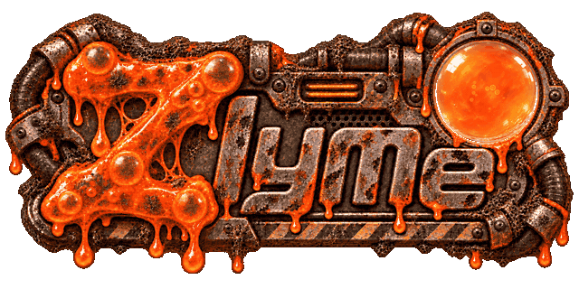

**Low latency. High viscosity.**

Zlyme is a custom OS for the **Miyoo Flip**, built with Buildroot on a mainline Linux kernel. It's engineered to ooze, cultured for speed. Hardware facts come from this device, and emulator recipes are harvested where they already exist. Every emulator and tool is pinned to a revision that's known to work here, not whatever upstream published last night. The set is curated so it fits the Flip, instead of shipping a hundred cores nobody on this board will use.

The frontend is Zlyme's fork of [NextUI](https://github.com/LoveRetro/NextUI) (itself from [MinUI](https://github.com/shauninman/MinUI) by [Shaun Inman](https://github.com/shauninman)). No desktop, and no compositor sitting in the background: the menu and the games draw straight to the screen. Wine gets its own Weston for as long as it runs, and a PortMaster port that needs X11 brings PortMaster's WestonPack. When the app closes, they're gone. It boots fast and gets out of the way.

“It’s not buttery smooth. It’s slime-smooth.”

The Miyoo Flip is the only device Zlyme supports. The tree is laid out so another handheld could be ported one day, but nobody is promising one.

## What's Flip-specific in here

Zlyme isn't a generic RK3566 image with a frontend dropped on top. Mainline Linux doesn't know much about this handheld, so Zlyme carries the Flip support itself:

- **The gamepad.** `miyoo-flip-gamepad` is Zlyme's own out-of-tree driver for the Flip's controls: the analog sticks on the UART, the GPIO buttons, stick calibration and deadzone, and force-feedback rumble.
- **Deep suspend.** The BL31 suspend integration the Flip needs, including switching its `vdd_logic` rail off while asleep. Press power and it really sleeps, then wakes with your game where you left it. The lid is a separate path: close it while a game runs and the screen blanks and the radios stop, but it doesn't deep-suspend. Use the power button for that.
- **DDR scaling.** The selected mainline kernel has no RK3566/RK3568 DDR frequency driver, so Zlyme carries the external `rk3568_dmc` module. Memory clocks drop for light games and come back up for heavy ones.
- **Wi-Fi and Bluetooth.** They share one RTL8733BU chip, and powering it isn't just a userspace toggle. The radio driver is a pinned third-party `8733bu`. Zlyme adds its own `rtl8733bu-power` module for the chip's power and rfkill, and the kernel carries the Bluetooth support patch for it.
- **The off-state drain.** The Flip's RK817 power chip used to keep draining the battery with the device off under mainline. Zlyme fixes that. A small drain while it's off is still normal.

Wi-Fi, Bluetooth audio and controllers, HDMI, sleep, the lid, the sticks, rumble, the headphone jack, USB OTG and both SD slots all work. Two GPU drivers ship: Mali (the default, with Vulkan) and Panfrost (no Vulkan). Per-system CPU frequency floors are adapted from [SpruceOS](https://spruceui.github.io/) Miyoo Flip tuning onto Zlyme's mainline frequency table; the governor, core count and memory clocks are Zlyme's own.

The gory details, register by register, live in the [Miyoo Flip hardware wiki](https://github.com/Zetarancio/Miyoo-Flip-Mainline-Linux-Reverse-Engineering).

## Install

### 1. Let the Flip boot from SD

Out of the box the Flip boots stock firmware from internal storage and ignores the card. A fresh `zlyme.img` carries `miyoo355_fw.img` on the boot partition. That file is [apommel](https://github.com/apommel)'s installer from [baseos-my355](https://github.com/apommel/baseos-my355), built from a pinned commit. It is not a replacement preloader.

1. Write `zlyme.img` to the card (the next section).
2. Put the card in the **right** slot, next to power. Stock looks for `miyoo355_fw.img` on a card it can see. The installer reboots into the card when that card is in the right-hand slot.
3. Boot **stock**. Stock runs the installer. The installer reads this unit's own preloader, saves `mtd5-original-<sha256>.img` on the card, patches only the SPL `/pinctrl` data, checks the write, and leaves the DDR blob and SPL code alone.
4. Boot again from the card. No card, the Flip still boots stock.

Writing the image does not modify internal NAND. Stock is what consumes `miyoo355_fw.img`. Zlyme does not do that write during boot or during an update.

The older manual [apommel-multiboot](https://github.com/Zetarancio/Miyoo-Flip-Mainline-Linux-Reverse-Engineering/blob/main/docs/boot-and-flash/sd-multiboot-apommel.md) app is the historical way to do the same repair. Erasing the preloader, so the Flip always boots from SD or drops into MASKROM, stays a separate destructive choice: [stock ↔ SD-boot without opening the device](https://github.com/Zetarancio/Miyoo-Flip-Mainline-Linux-Reverse-Engineering/blob/main/docs/boot-and-flash/stock-rocknix-without-disassembly.md). On a Zlyme card, Tools → Preloader Recovery can restore that backup or erase the preloader. Those screens default to cancel.

### 2. Write the OS card with the Zlyme Installer

The [Zlyme Installer](https://github.com/Zetarancio/zlymeOS-Installer) is the easy way. Grab it from that repository's [Releases page](https://github.com/Zetarancio/zlymeOS-Installer/releases), run it, pick your card. It fetches the latest Zlyme release, takes the `zlyme.img`, writes it to the card as a raw disk image, and reminds you about the preloader. There are builds for Windows, macOS and Linux. They aren't code-signed, so your OS will grumble once.

It's a fork of the [SpruceOS Installer](https://github.com/spruceUI/spruceOS-Installer). [SundownerSport](https://github.com/Sundownersport) kindly made the original Zlyme adaptation.

Writing the image erases the whole card. Use a dedicated OS card, not one that already holds your games.

### Or write it by hand

Download `zlyme.img` from the latest [Zlyme release](https://github.com/Zetarancio/zlyme/releases/latest) and write it with [Balena Etcher](https://etcher.balena.io/) or any raw-image writer. Same warning: the whole card gets overwritten.

### 3. Boot it

Put the OS card in the **right** slot, next to power, and turn the Flip on. The first boot grows the storage partition to fill the card and reboots once by itself.

## Load your games

The OS card is a game library, and so is a second SD card in the left slot or a USB disk on OTG. Each library has `Roms/`, `Bios/` and `Saves/`.

1. On a blank card, run **Settings → System → Storage → Create game folders**. It creates every system folder and leaves existing games alone.
2. Copy each game into its folder under `Roms/`, using the name from the [systems table](#systems-and-emulators). A Game Boy Advance game goes in `Roms/Game Boy Advance (GBA)/`. The tag in parentheses picks the emulator, so keep it exactly as written.
3. BIOS files go in `Bios/`, under the names in the table.
4. Put the card back (or plug the disk in). A system shows up in the menu once a library holds a game it can launch. Empty folders don't count.

Pulling the card every time gets old. Turn on SSH (it does SFTP) or Samba in Settings and copy over Wi-Fi instead. Your settings live in `/storage/.config` on the OS card.

Which BIOS copy wins, where new saves go, multi-disc playlists and box art are in the [user guide](docs/USER_GUIDE.md#libraries-and-storage).

## Update

**Settings → Update** checks the newest release on the channel you chose (Releases or Prereleases) and shows its notes, which scroll. It downloads the update and queues it only after the SHA-256 matches. If that version is already installed, or the card already has that exact firmware, it says so and still lets you download it again. If your system exactly matches the base of a smaller delta update, it may grab that instead, rebuild a complete system image from it, and check that image too. Nothing on the running system changes until the reboot that installs it. Games, BIOS, saves and settings stay.

Doing it by hand: copy the full `zlyme-my355-<date>-<sha>.tar` from a release (not a delta) into `/storage/.update` and reboot.

Builds you make yourself produce full updates only. What an update does to paks you've edited is under [the Right to Experiment](#user-systems-and-tools-and-the-right-to-experiment).

## Controls

**Launcher**

- A open, B back
- MENU tap = quick menu
- Vol = volume
- **MENU+Vol** = brightness
- **MENU+Y** = emulator / governor for the highlighted console, folder or ROM. On a ROM it also offers Delete game.
- Power = sleep

**In a pak / game**

- **MENU+Start** closes whatever is running (libretro, standalones, PortMaster, Pico-8, Tools)
- MENU tap = RetroArch RGUI; standalones keep their own menu

Speaker and headphones switch by themselves. Bluetooth audio follows the headset when it connects.

## Settings and Tools

**Settings** is part of Zlyme's NextUI fork and opens from Tools. It is the first entry there. Wi-Fi, Bluetooth, SSH, Samba, Syncthing, backup, joysticks, storage, the time zone and **Update** are in there. On a restricted network, Settings → Network → Proxy can send online services through an HTTP or SOCKS proxy. That is not a VPN. Hardware switches (GPU, ZRAM, USB OTG, HDMI, the second SD slot, system logs, CPU undervolt) sit under System → Advanced. Undervolt stays off unless you turn it on. Logs are off until you enable System → Advanced → System logs; then they go to `/storage/.logs`. The [user guide](docs/USER_GUIDE.md#settings) goes page by page.

The community tools below were adapted to Zlyme's paths, controls and bundled binaries.

- **ZcrapeGoat**: based on ScrapeGoat by Helaas. Artwork, manuals and metadata from ScreenScraper, and cheats from Libretro. Bring your own ScreenScraper account for art; cheats don't need one. Zlyme's application credentials are built in and never shown. Upstream is [nextui-scrapegoat-pak](https://github.com/Helaas/nextui-scrapegoat-pak) v2.3.0. Usage: [user guide](docs/USER_GUIDE.md#zcrapegoat).
- **Overlays**: community bezels, one game folder at a time. The same system on another card is a separate choice. The tool is [NextUI-Overlays](https://github.com/zolek86/NextUI-Overlays) v0.1.1 by zolek86; the bezels come from [nextui-community-overlays](https://github.com/LoveRetro/nextui-community-overlays).
- **Moonlight**: stream a PC game to the Flip. The menu is [nextui-moonlight-pak](https://github.com/richieszemeredi/nextui-moonlight-pak); the streamer is [moonlight-embedded](https://github.com/moonlight-stream/moonlight-embedded).
- **PortMaster**: install game ports. From [PortMaster-GUI](https://github.com/PortsMaster/PortMaster-GUI). Install location and colours: [user guide](docs/USER_GUIDE.md#portmaster).
- **Files**: a file browser, [vtree](https://github.com/MustardOS/vtree). Hidden files show until you turn that off.
- **Music Player**: [nextui-music-player](https://github.com/nborodikhin/nextui-music-player) v1.17.0 by nborodikhin. Local music in `/storage/Music`, podcasts in `/storage/Podcasts`, and online radio. The optional YouTube helpers download only when you ask. Zlyme updates the player; it doesn't update itself.

## Systems and emulators

Folders sit under `Roms/` on any library. BIOS names are inside `Bios/` on any mounted library. "alt:" marks an emulator you can switch to from the MENU+Y Emulator row.

| System                  | Emulator                                             | Folder                                            | Files                                                                        | Bios                                                                                        |
| ----------------------- | ---------------------------------------------------- | ------------------------------------------------- | ---------------------------------------------------------------------------- | ------------------------------------------------------------------------------------------- |
| NES                     | Nestopia (libretro)                                  | `Roms/Nintendo Entertainment System (FC)/`        | `.nes` `.unif` `.unf` `.fds` `.zip` `.7z`                                    | `disksys.rom` (FDS, optional)                                                               |
| Game Boy                | Gambatte (libretro)                                  | `Roms/Game Boy (GB)/`                             | `.gb` `.zip` `.7z`                                                           | `gb_bios.bin` (optional)                                                                    |
| Game Boy Color          | Gambatte (libretro)                                  | `Roms/Game Boy Color (GBC)/`                      | `.gbc` `.gb` `.zip` `.7z`                                                    | `gbc_bios.bin` (optional)                                                                   |
| Game Boy Advance        | gpSP (libretro)                                      | `Roms/Game Boy Advance (GBA)/`                    | `.gba` `.zip` `.7z`                                                          | `gba_bios.bin`                                                                              |
| SNES                    | Beetle Supafaust (libretro)                          | `Roms/Super Nintendo Entertainment System (SFC)/` | `.smc` `.sfc` `.fig` `.swc` `.bsx` `.zip` `.7z`                              | —                                                                                           |
| Master System           | Genesis Plus GX (libretro); alt: PicoDrive           | `Roms/Sega Master System (MS)/`                   | `.sms` `.bin` `.zip` `.7z`                                                   | `bios_*.sms` (optional)                                                                     |
| Game Gear               | Genesis Plus GX (libretro); alt: PicoDrive           | `Roms/Sega Game Gear (GG)/`                       | `.gg` `.bin` `.zip` `.7z`                                                    | `bios.gg` (optional)                                                                        |
| SG-1000                 | Genesis Plus GX (libretro)                           | `Roms/Sega SG-1000 (SG1000)/`                     | `.sg` `.bin` `.zip` `.7z`                                                    | —                                                                                           |
| Mega Drive / Genesis    | PicoDrive (libretro); alt: Genesis Plus GX           | `Roms/Sega Genesis (MD)/`                         | `.md` `.smd` `.gen` `.bin` `.zip` `.7z`                                      | `bios_CD_U.bin` / `E` / `J` (Mega CD, optional)                                             |
| 32X                     | PicoDrive (libretro)                                 | `Roms/Sega 32X (32X)/`                            | `.32x` `.smd` `.md` `.bin` `.zip` `.7z`                                      | same Mega CD files (optional)                                                               |
| PC Engine               | Beetle PCE Fast (libretro)                           | `Roms/PC Engine (PCE)/`                           | `.pce` `.cue` `.ccd` `.iso` `.img` `.chd` `.sgx` `.zip` `.7z` `.m3u`         | `syscard3.pce` (CD, optional)                                                               |
| SuperGrafx              | Beetle SuperGrafx (libretro)                         | `Roms/SuperGrafx (SGX)/`                          | `.sgx` `.pce` `.cue` `.ccd` `.chd` `.zip` `.7z`                              | —                                                                                           |
| ColecoVision            | Gearcoleco (libretro)                                | `Roms/ColecoVision (COLECO)/`                     | `.col` `.bin` `.rom` `.zip` `.7z`                                            | `colecovision.rom` (or `coleco.rom`)                                                        |
| Intellivision           | FreeIntv (libretro)                                  | `Roms/Intellivision (INTV)/`                      | `.int` `.bin` `.rom` `.zip` `.7z`                                            | `exec.bin` `grom.bin`                                                                       |
| MSX                     | blueMSX (libretro)                                   | `Roms/MSX (MSX)/`                                 | `.mx1` `.mx2` `.dsk` `.rom` `.cas` `.zip` `.7z`                              | none to add (`Machines/` `Databases/` ship in the image)                                    |
| Odyssey 2               | O2EM (libretro)                                      | `Roms/Odyssey 2 (O2)/`                            | `.bin` `.zip` `.7z`                                                          | `o2rom.bin`                                                                                 |
| Vectrex                 | vecx (libretro)                                      | `Roms/Vectrex (VEC)/`                             | `.vec` `.bin` `.gam` `.zip` `.7z`                                            | —                                                                                           |
| Neo Geo (AES/MVS)       | FinalBurn Neo (libretro)                             | `Roms/FBNeo (FBNEO)/`                             | `.zip` `.7z`                                                                 | `neogeo.zip` in `Bios/`, `Bios/fbneo/`, or `Bios/FBNEO/`                                    |
| Arcade                  | MAME 2003-Plus (libretro)                            | `Roms/MAME (MAME)/`                               | `.zip` `.7z`                                                                 | BIOS zips in `Bios/`, `Bios/MAME/`, or `Bios/mame2003-plus/`                                |
| Neo Geo CD              | NeoCD (libretro)                                     | `Roms/Neo Geo CD (NEOCD)/`                        | `.cue` `.iso` `.chd`                                                         | `neocd/neocd.bin`, `neocd/uni-bioscd.rom`, or `neocd/neocd_z.rom` (`Bios/` root also works) |
| Neo Geo Pocket          | Beetle NGP (libretro)                                | `Roms/Neo Geo Pocket (NGP)/`                      | `.ngp` `.ngc` `.zip` `.7z`                                                   | —                                                                                           |
| WonderSwan              | Beetle WonderSwan (libretro)                         | `Roms/WonderSwan (WS)/`                           | `.ws` `.wsc` `.zip` `.7z`                                                    | —                                                                                           |
| Virtual Boy             | Beetle VB (libretro)                                 | `Roms/Virtual Boy (VB)/`                          | `.vb` `.zip` `.7z`                                                           | —                                                                                           |
| Pokémon Mini            | PokeMini (libretro)                                  | `Roms/Pokemon Mini (PKM)/`                        | `.min` `.zip` `.7z`                                                          | `bios.min` (optional)                                                                       |
| Atari 2600              | Stella (libretro)                                    | `Roms/Atari 2600 (A26)/`                          | `.a26` `.bin` `.zip` `.7z`                                                   | —                                                                                           |
| Atari 5200              | a5200 (libretro)                                     | `Roms/Atari 5200 (A5200)/`                        | `.a52` `.bin` `.zip` `.7z`                                                   | `5200.rom`                                                                                  |
| Atari 7800              | ProSystem (libretro)                                 | `Roms/Atari 7800 (A78)/`                          | `.a78` `.bin` `.zip` `.7z`                                                   | `7800 BIOS (U).rom`                                                                         |
| Atari 8-bit             | Atari800 (libretro)                                  | `Roms/Atari 8-bit (A800)/`                        | `.atr` `.atx` `.rom` `.xex` `.cas` `.car` `.zip` `.7z`                       | `ATARIOSB.ROM` `ATARIXL.ROM`                                                                |
| Atari ST                | Hatari (libretro)                                    | `Roms/Atari ST (ST)/`                             | `.st` `.msa` `.stx` `.dim` `.ipf` `.zip` `.7z`                               | `tos.img` or EmuTOS `etos*.img` (in `Bios/` or `Bios/ST/`)                                  |
| Atari Lynx              | Handy (libretro)                                     | `Roms/Atari Lynx (LYNX)/`                         | `.lnx` `.lyx` `.bll` `.o` `.zip` `.7z`                                       | `lynxboot.img`                                                                              |
| 3DO                     | Opera (libretro)                                     | `Roms/3DO (3DO)/`                                 | `.iso` `.chd` `.cue`                                                         | `panafz10.bin`                                                                              |
| DOS                     | DOSBox Pure (libretro)                               | `Roms/DOS (DOS)/`                                 | `.exe` `.com` `.bat` `.dos` `.dosz` `.zip` `.iso` `.cue` `.m3u` `.m3u8`      | —                                                                                           |
| PlayStation             | PCSX ReARMed (libretro)                              | `Roms/Sony PlayStation (PS)/`                     | `.cue` `.chd` `.m3u` `.pbp` `.iso` `.ccd` `.img` `.toc`                      | `scph5500.bin` / `scph5501.bin` / `scph5502.bin`                                            |
| PlayStation 2           | AetherSX2                                            | `Roms/Sony PlayStation 2 (PS2)/`                  | `.iso` `.chd` `.cso` `.mdf` `.nrg` `.bin` `.img` `.dump` `.gz` `.m3u` `.elf` | BIOS dumps in `Bios/PS2/` (not in the ROM folder)                                           |
| Nintendo 64             | Mupen64Plus-Next (libretro)                          | `Roms/Nintendo 64 (N64)/`                         | `.z64` `.n64` `.v64` `.zip` `.7z`                                            | —                                                                                           |
| GameCube                | Dolphin                                              | `Roms/Nintendo GameCube (GC)/`                    | `.gcm` `.iso` `.gcz` `.ciso` `.wbfs` `.rvz` `.m3u` `.elf` `.dol`             | `GC/USA/IPL.bin` (optional; also EUR/JAP; `Bios/IPL.bin` or `Bios/GC/IPL.bin` also works)   |
| Wii                     | Dolphin                                              | `Roms/Nintendo Wii (WII)/`                        | `.gcm` `.iso` `.wbfs` `.gcz` `.ciso` `.rvz` `.wad` `.m3u` `.elf` `.dol`      | same IPL (optional); extra files in `Bios/WII`                                              |
| Saturn                  | YabaSanshiro (libretro)                              | `Roms/Sega Saturn (SATURN)/`                      | `.cue` `.ccd` `.chd` `.iso`                                                  | `saturn_bios.bin`                                                                           |
| TIC-80                  | TIC-80 (libretro)                                    | `Roms/TIC-80 (TIC)/`                              | `.tic`                                                                       | —                                                                                           |
| Pico-8                  | Official PICO-8 (you add it); alt: fake-08           | `Roms/Pico-8 (PICO)/`                             | `.p8` `.png` `.zip`                                                          | `PICO/pico8_64` and `PICO/pico8.dat`                                                        |
| Pico-8 (fake-08)        | fake-08 (libretro); alt: official PICO-8             | `Roms/Pico-8 fake-08 (P8)/`                       | `.p8` `.png` `.zip`                                                          | — (the alt needs the PICO pair)                                                             |
| PSP                     | PPSSPP                                               | `Roms/Sony PlayStation Portable (PSP)/`           | `.iso` `.cso` `.pbp` `.chd`                                                  | —                                                                                           |
| Dreamcast               | Flycast                                              | `Roms/Sega Dreamcast (DC)/`                       | `.cdi` `.gdi` `.cue` `.chd` `.m3u`                                           | `dc_boot.bin` `dc_flash.bin` in `Bios/DC/` or `Bios/`                                       |
| Nintendo DS             | DraStic                                              | `Roms/Nintendo DS (NDS)/`                         | `.nds` `.zip` `.7z`                                                          | —                                                                                           |
| Amiga                   | Amiberry                                             | `Roms/Commodore Amiga (AMIGA)/`                   | `.adf` `.ipf` `.hdf` `.lha` `.cue` `.iso` `.chd` `.zip`                      | kickstarts optional; AROS ships in the image                                                |
| Doom                    | GZDoom                                               | `Roms/Doom (DOOM)/`                               | `.wad` `.iwad` `.pwad` `.pk3`                                                | —                                                                                           |
| Flash                   | Ruffle Handheld (SilverPsychoo)                      | `Roms/Flash (FLASH)/`                             | `.swf`                                                                       | —                                                                                           |
| Ports                   | PortMaster                                           | `Roms/Ports (PORTS)/`                             | `.sh` only                                                                   | —                                                                                           |
| RPG Maker 2000/2003     | EasyRPG Player (libretro)                            | `Roms/RPG Maker 2000-2003 (EASYRPG)/`             | `.zip` `.lzh` `.ldb` `.easyrpg`; folders with `RPG_RT.ldb` or `*.easyrpg`    | `rtp/2000` `rtp/2003` (optional)                                                            |
| RPG Maker XP / VX / Ace | mkxp-z (libretro)                                    | `Roms/RPG Maker XP-VX-Ace (MKXPZ)/`               | `.ini` `.json` `.rxproj` `.rvproj` `.rvproj2` `.mkxpz` `.zip` `.7z`          | `mkxp-z/RTP` (optional)                                                                     |
| ScummVM                 | ScummVM                                              | `Roms/ScummVM (SCUMMVM)/`                         | `.scummvm` `.svm` `.zip`; game folders                                       | —                                                                                           |
| OpenBOR                 | OpenBOR                                              | `Roms/OpenBOR (OPENBOR)/`                         | `.pak`                                                                       | —                                                                                           |
| Daphne                  | Hypseus Singe                                        | `Roms/Daphne (DAPHNE)/`                           | `.txt` `.daphne` `.singe`                                                    | —                                                                                           |
| Windows                 | Wine 11.6 WoW64 via Box64, temporary Weston          | `Roms/Windows (WINE)/`                            | `.exe` `.msi` `.bat` `.cmd`                                                  | —                                                                                           |

- **PSP:** PPSSPP renders with OpenGL, or with Vulkan when you pick it in PPSSPP and the Mali driver is active.
- **Pico-8:** native PICO-8 is the Raspberry Pi build you bought from Lexaloffle. Zlyme doesn't include or download it. Fake-08 doesn't need it. Setup and Splore: [user guide](docs/USER_GUIDE.md#pico-8-and-splore).
- **Multi-disc games** use an `.m3u` playlist: [user guide](docs/USER_GUIDE.md#multi-disc-games).
- **OpenBOR** saves go in the library `Saves/OPENBOR` folder. The engine does not create its runtime folders in the ROM directory.
- **RPG Maker XP, VX, and Ace** accept a project file, or a `.zip`, `.7z`, or `.mkxpz` with the project at the archive root or in one top folder.
- **Windows** games use Kron4ek Wine 11.6 WoW64 under Box64 0.4.4. The prefix is `/storage/.config/nextui/my355/wine-prefix`. An update deletes an older `wine-prefix.ext4`.

## User Systems and Tools and the Right to Experiment

The paks on the card are yours to poke at. You don't need to rebuild the OS to try something.

Stock copies live on the OS card in `Tools/my355/` and `Emus/my355/`. Each system is a pair: `Emus/my355/TAG.pak/launch.sh` launches the games in `Roms/Pretty Name (TAG)/`, and gets the ROM path as its argument. A tool is just `Tools/my355/My Tool.pak/launch.sh`; it shows up under Tools once the list restarts. The existing paks are the examples (the libretro ones are a few lines around `ra-run -L …`).

So copy a pak and break it. Change the launcher, swap the core, point it at another binary, write a new tool, add a system nobody asked for. An update only replaces pak **names that exist in the image**. Edit `GBA.pak` and the next update puts the stock one back. Copy it to `GBA2.pak` and it survives, but its games have to live in `Roms/… (GBA2)/`. Factory Reset restores the stock names too.

Stock NextUI paks from elsewhere usually need their paths, controls or binaries adapted before they run here. Some will just work; plenty won't. The [user guide](docs/USER_GUIDE.md#custom-paks) has the details.

### Bring it back upstream

If an experiment turns into something good, it can ship in the OS. That's the point of all this.

You don't need a finished patch to start. Forks, pull requests, a bug report with the logs attached, a fixed typo in the docs, a core that runs better, a new or improved pak, frame-time numbers, a power or current measurement off a real Flip, a design idea, a review of code that's already here, or just a question before you write any code: all welcome. [CONTRIBUTING.md](CONTRIBUTING.md) explains how.

Want to talk first? Zlyme hangs out in the [SpruceOS Discord](https://discord.gg/KjR5uMQQt9), where the SpruceOS team has kindly given the project a home.

A lot of time has gone into the documentation in this repository and into the [Miyoo Flip hardware wiki](https://github.com/Zetarancio/Miyoo-Flip-Mainline-Linux-Reverse-Engineering), so nobody has to rebuild this project from old chats and hundreds of commits. If you want to understand or fork Zlyme with an AI coding tool, clone the repository and give it the `docs/` folder. The docs were written to make the project easier to understand, change and extend. The hardware wiki is where the deeper Flip knowledge lives. AI can help you find your way around, but the source, the tests and a real Flip are still the evidence.

## Build it yourself

You need Docker.

```sh
git clone https://github.com/Zetarancio/zlyme.git
cd zlyme
cp storage.sh.example storage.sh   # optional; set local paths
./build.sh --config zlyme_my355_defconfig
```

The image and the update tar land in `output/images/`. `./build.sh --help` lists the options. To ship a pak with the OS, put it under `package/system/nextui/paks/Emus` or `package/system/nextui/paks/Tools`. [docs/DEVELOPMENT.md](docs/DEVELOPMENT.md) covers rebuilding one package at a time, so you don't sit through a full image for every edit.

## Documentation

- [docs/USER_GUIDE.md](docs/USER_GUIDE.md): day-to-day use, page by page.
- [CONTRIBUTING.md](CONTRIBUTING.md): how to help.
- [CHANGELOG.md](CHANGELOG.md): what changed in each release.
- [docs/](docs/): how Zlyme is built and why. Start at [docs/ARCHITECTURE.md](docs/ARCHITECTURE.md).
- [Miyoo Flip hardware wiki](https://github.com/Zetarancio/Miyoo-Flip-Mainline-Linux-Reverse-Engineering): the hardware itself, independent of any OS.

## Thanks

- [Sundownersport](https://github.com/Sundownersport) and the community behind [SpruceOS](https://spruceui.github.io/) for their continuing work and support, for the original Zlyme Installer, and for hosting Zlyme's corner of the SpruceOS Discord.
- The frontend is based on [NextUI](https://github.com/LoveRetro/NextUI), a fork of [MinUI](https://github.com/shauninman/MinUI) by [Shaun Inman](https://github.com/shauninman). SD multiboot (repaired preloader) is derived from [apommel](https://github.com/apommel)’s work in [baseos-my355](https://github.com/apommel/baseos-my355).
- Flash games run on [Ruffle Handheld](https://github.com/SilverPsychoo/Ruffle-Handheld) v4.2 by SilverPsychoo.
- The joystick calibration workflow is based in part on Joe's Calibrage by Kevin Vranken, MIT.
- Discord user `lazydog` for the Wine compatibility suggestion that prompted the zlyme44.2 WoW64 and prefix rework.

## License

See [LICENSE](LICENSE). Original Zlyme glue is MIT. This tree is **not** one license. NextUI (LoveRetro) is PolyForm Noncommercial 1.0.0 and must stay that way; it is a fork of MinUI by Shaun Inman. minui-list and minui-presenter are MIT (Jose Diaz-Gonzalez) and, on this image, link NextUI. Each package and pak ships its own terms.
